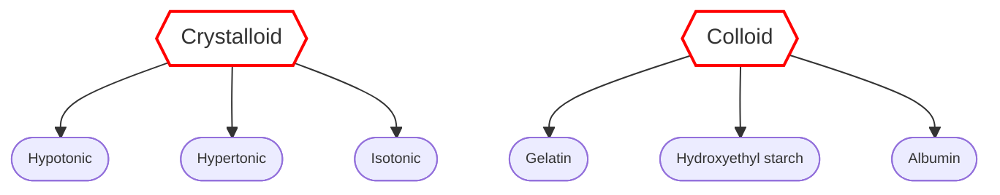

- Osmolarity = mol ในสารละลาย 1L
- Osmolality = mol ในสารละลาย 1kg
	- Osmolarity / 0.93 เพราะ plasma มี lipid + protein
- Corrected osmolality ขึ้นกับ % การเเตกตัว
	- 0.9% NaCl 308 mOsm/kg เเต่เเตกตัว 93% → 286 mOsm/kg
- Tonicity = osmolality จากตัวละลายที่ไม่เเพร่ผ่าน
# Body fluid distribution
## ECF component
- Male = 60%
- Female, elderly = 50%<br>
- Intracellular 
- Extracellular
	- Intravascular (7.5)
	- Interstitial (20)
	- Transcellular (2.5) = peritoneal, pleural, pericardial
	- Dense CNT (15)
![[image-17.png|300]]
## Water balance regulation
1. Baroreceptor reflex = กระตุ้น symp → ↑ HR, SV, VR, TPR
	- Location = carotid sinus, aortic arch, atrial stretch
2. RAAs + ADH
	- Aldosterone <span class="hl4">(adrenal gland)</span> = ↑ Na reabsorption
	- ADH <span class="hl4">(hypothalamus) </span>= ↑ water reabsorption
3. Reabsorption = arteriole constriction → ↓ osmotic pressure / ↑ oncotic pressure → น้ำกลับเข้าเส้นเลือด
	- ทำให้ใน acute blood loss ความเข้มข้นเลือดลดลง
# 1. Assessment
- Periop ไม่สามารถประเมิน volume status ได้ เพราะมียาดมสลบกวน ต้องใช้การคำนวณเท่านั้น
- BP ต้องดู baseline คนไข้ ในคนที่เป็น HT อาจจะมี false high
- Passive leg rasing test = ถ้า CO เพิ่มมากกว่า 10% ใน 30-90sec เเสดงว่ายังต้องการน้ำเพิ่ม
	![[IMG_4926.jpeg|300]]
- Severity grading (trauma)
	- gr. 2 = narrow PP
	- gr. 3 = hypotension
![[Screenshot 2568-11-19 at 01.19.38.png]]
```dataviewjs
/* const data = [
  ["2020–2021", "Intern"],
  ["2022–2023", "Resident"],
  ["2024–present", "Fellow"]
]; */

const data = [
 ['Hypovolemia', '&minus; Vomiting<br>- Diarrhea<br>- Fever, sepsis<br>- Trauma', '&minus; Poor skin turgor<br>- Cap refil > 2sec<br>- Dry mucous memb<br>- Tachycardia<br>- Orthostatic hypotension', '&minus; ↑ Hct<br>- Contraction alkalosis → metabolic acidosis<br>- HyperNa<br>- Urine Sp.gr. > 1.010<br>- BUN:Cr = 10:1'],
 ['Hypervolemia', '&minus; Weight gain<br>- Edema<br>- Wheezing<br>- Renal failure', '&minus; Pitting edema<br>- Crackle, wheezing<br>- Ascites<br>- ↑ JVP', '&minus; CXR: lung marking<br>- US: B line'],
];

const header = ['Status', 'Hx', 'PE', 'Lab']
// @no-refresh
dv.table(header, data);
dv.container.classList.add("top", 'side', 'spread');
```

# 2. Indication
- Resuscitation
	- Correct volume def.
	- Acute hypovolumic shock
	- Mx = balanced salt sol 250-500ml in 15min เเล้วประเมิน BP & I/O
- Maintenance
	- Hemodynamic stable pt.
	- NPO
- Deficit (replacement) = กินได้ เเต่กินไม่ทันน้ำที่เสียไป
	- ให้เท่า maintenance หรืออาจจะปรับลดลงตามอาการของคนไข้
- Concurrent loss (fluid creep)
# 3. Prescription
## Type of fluid
- Crystalloid = ตัวถูกละลาย molecule เล็ก ออกนอก vessel ได้
	- ในการ resus จะใช้ crystalloid (balanced salt sol) เนื่องจาก colloid มี side effect เยอะ
- Colloid = ตัวถูกละลาย molecule ใหญ่ ไม่ออกนอก vessel

### Crystalloid
- Hypotonic = เติมน้ำเข้า cell
- Hypertonic = ดึงน้ำออกจาก cell
- Isotonic
	- Saline solution = Cl สูงกว่าเลือด
		- <span class='hl2'>NSS</span> = ↑ Cl → AKI + <span class='hl1'>metabolic acidosis (hyperCl)</span>
			- Indication 
				- Cerebral edema = hypertonic sol
				- Hypovol hyponat = Na replacement
				- HypoCl met alkalosis <span class="hl4">eg. gastric outlet obstruction</span>
	- Balanced crystalloid = elyte ใกล้เคียงเลือด
		- <span class='hl2'>Lactated Ringer's</span>
			- Cell edema <span class='hl1'>ต้องระวังใน</span> Brain edema + cirrhosis
			- ± Polyuria
			- Interfere with insulin lvl = hyperglycemia ใน intraop
			- ไม่เเนะนำใน liver dysfunction เพราะ metabolite ที่ liver
		- <span class='hl2'>Acetated Ringer's </span>
			- CVS depression → BP drop
		- <span class='hl2'>Plasmalyte</span> (isotonic balanced crystalloid solution)
			- เหมือน Lactated Ringer เเต่ ↓ risk of edema
### Colloid
- <span class='hl2'>Gelatin </span>
	- Elimination (kidney) → half-life 60min
	- Kidney elimination 50%
	- <span class='hl1'>Anaphylaxis</span>
- <span class='hl2'>Hydroxyethyl starch </span>
	- Slow elimination (kidney, bile, stool) → wks
	- **โอกาสเเพ้ต่ำ**
	-  ↑ Mortality in sepsis
		- เลือดเเข็วตัวช้า
		- Oliguria → AKI
- <span class='hl2'>Albumin </span>
	- Elimination → half-life 16hr
	- ↑ Mortality in head trauma
		- Hyperoncotic
## Volume & rate

> [!info] Loading
> - Hypotension = NSS loading & reassess
> - Hypovolemic shock = blood / BSS loading
> - Septic shock = BSS loading 30ml/kg in 3hr + NorE
### Maintenance
- Common used = 5% DN 5 $\frac{1}{2}$
	- เพราะ dextrose เป็นเเหล่งพลังงาน ป้องกัน ketosis
	- ถ้าเป็น DM ให้ตัวที่ไม่มีน้ำตาล เเล้วเจาะ DTX keep 80-180
- **Holliday-Segor**
	- Volume = 100-50-20 (/day)
	- Rate = 4-2-1 (/hr)<br>
	- 60kg ให้
		- Volume = 1000 + 500 + 20x40 = 2300 ml
		- Rate = 40 + 20 + 1x40 = 100 ml/hr
### Deficit
- Deficit<sub>น้ำที่ควรให้</sub> = maintenance x NPO hour
	- เเบ่งให้เป็น (เอาไปรวมกับ maintenance ที่คำนวณได้ด้วย)
		- 1st hr = 1/2 of total
		- 2nd hr = 1/4 of total
		- 3rd hr = 1/4 of total
	![[Screenshot 2568-12-25 at 16.53.14.png|300]]
- In bowel preparation = crystalloid 1-2L + K supplement
### Concurrent loss
- Insensible loss (เสียจากอวัยวะภายในสัมผัสกับอากาศ) < 1 ml/kg/hr
- Sensible loss (เสียเลือด) ทดเเทนด้วย crystalloid:loss = 3:1
- 3rd space loss (น้ำไปอยู่ที่บริเวณที่บาดเจ็บ) คำนวณตามขนาดหัตถการ
	- Minimal procedure (hernia) = 2-4 ml/kg/hr
	- Mod procedure (cholecystectomy) = 4-6 ml/kg/hr
	- Major procedure (colectomy) = 6-8 ml/kg/hr
## Special fluid indication
### Blood
- Hb < 10 in CVS dz
- Hb < 7 
- Hb 7-10 with
	- Ongoing organ ischemia
	- Potential ongoing blood loss
	- Volume status
	- Risk factor for inadequte O2 <span class="hl4">(ex. MI)</span>
- <span class='hl4'>เลือด 1 U = Hct +3</span>

> [!tip] Maximum allowance blood loss
> $$ ABL = \frac{[BW\times Average\ blood\ volume\times(H_i-H_f)]}{H_{av}} $$
> - $H_f$ = 7
> - $H_av$ = average of $H_i$ & $H_f$
> - Average blood volume
> 	- Male = 75
> 	- Female = 65

### FFP (fresh frozen plasma)
- Correct microvascular bleeding = INR > 2
- Massive transfusion
- Urgent warfarin reversal 
	- <span class="hl4">อาจจะใช้ PCC - prothrombin complex concentrate or IV vit-K เเทนได้ (ให้ผลดีกว่า)</span>
- Correction of factor def
### PLT
- plt < 50k undergoing Sx
- plt < 100k if concern of CNS bleeding
- plt < 10k (spontaneous bleeding)
### KCl
- <span class='hl1'>ห้ามให้ IV push / เจือจางทุกครั้ง</span> = cardiac arrest
- Peripheral infusion 
	- Max conc 100 mEq/L
	- Max rate 10 mEq/hr
- Central infusion
	- Max conc 200-400 mEq/L
	- Max rate 40 mEq/hr


